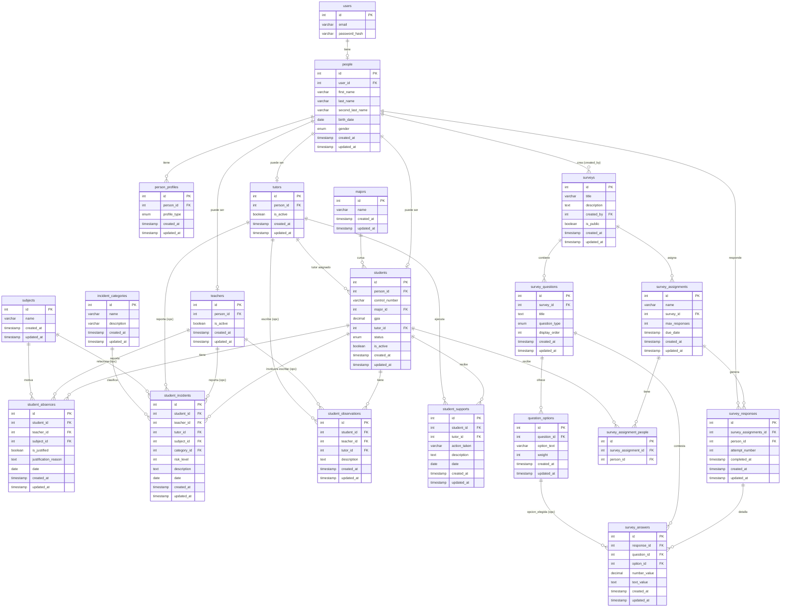

# Modelo de Base de Datos – Desertector

## Tablas y descripción de campos

### 1. `users`
Almacena las credenciales de acceso al sistema.

| Campo | Tipo | Límite | Descripción |
|-------|------|--------|-------------|
| `id` | INT | -- | Identificador autoincrementable (PK) |
| `email` | VARCHAR(100) | 100 | Correo institucional, formato único |
| `password_hash` | VARCHAR(255) | 255 | Contraseña cifrada |

---

### 2. `subjects`
Materias o asignaturas.

| Campo | Tipo | Límite | Descripción |
|-------|------|--------|-------------|
| `id` | INT | -- | Identificador autoincrementable (PK) |
| `name` | VARCHAR(255) | 1–255 | Nombre de la materia |
| `created_at` | TIMESTAMP | -- | Fecha de registro |
| `updated_at` | TIMESTAMP | -- | Fecha de actualización |

---

### 3. `majors`
Carreras universitarias.

| Campo | Tipo | Límite | Descripción |
|-------|------|--------|-------------|
| `id` | INT | -- | Identificador autoincrementable (PK) |
| `name` | VARCHAR(100) | 1–100 | Nombre de la carrera |
| `created_at` | TIMESTAMP | -- | Fecha de registro |
| `updated_at` | TIMESTAMP | -- | Fecha de actualización |

---

### 4. `people`
Datos personales y demográficos. Cada persona está vinculada a un usuario.

| Campo | Tipo | Límite | Descripción |
|-------|------|--------|-------------|
| `id` | INT | -- | Identificador autoincrementable (PK) |
| `user_id` | INT (FK) | -- | Referencia a `users.id` |
| `first_name` | VARCHAR(50) | 50 | Nombre(s) |
| `last_name` | VARCHAR(50) | 50 | Apellido paterno (o único) |
| `second_last_name` | VARCHAR(50) | 50 (nullable) | Apellido materno (opcional) |
| `birth_date` | DATE | -- | Fecha de nacimiento (YYYY-MM-DD) |
| `gender` | ENUM('M','F','O') | -- | Género: Masculino, Femenino, Otro |
| `created_at` | TIMESTAMP | -- | Fecha de registro |
| `updated_at` | TIMESTAMP | -- | Fecha de actualización |

**FK**: `user_id` → `users(id)`

---

### 5. `person_profiles`
Define los roles adicionales de una persona (estudiante, docente, tutor). Una persona puede tener múltiples perfiles.

| Campo | Tipo | Límite | Descripción |
|-------|------|--------|-------------|
| `id` | INT | -- | Identificador autoincrementable (PK) |
| `person_id` | INT (FK) | -- | Referencia a `people.id` |
| `profile_type` | ENUM('student','teacher','tutor') | -- | Tipo de perfil |
| `created_at` | TIMESTAMP | -- | Fecha de registro |
| `updated_at` | TIMESTAMP | -- | Fecha de actualización |

**FK**: `person_id` → `people(id)`

---

### 6. `students`
Perfil específico de estudiante.

| Campo | Tipo | Límite | Descripción |
|-------|------|--------|-------------|
| `id` | INT | -- | Identificador autoincrementable (PK) |
| `person_id` | INT (FK) | -- | Referencia a `people.id` |
| `control_number` | VARCHAR(20) | 20 | Número de control del alumno |
| `major_id` | INT (FK) | -- | Carrera que cursa (`majors.id`) |
| `gpa` | DECIMAL(5,2) | 0.00 – 100.00 | Promedio general |
| `tutor_id` | INT (FK) | -- (nullable) | Tutor responsable (`tutors.id`) |
| `status` | ENUM('enrolled','on_leave','graduated','dropped_out') | -- | Estado académico |
| `is_active` | BOOLEAN | -- | Registro activo / inactivo |
| `created_at` | TIMESTAMP | -- | Fecha de registro |
| `updated_at` | TIMESTAMP | -- | Fecha de actualización |

**FK**:
- `person_id` → `people(id)`
- `major_id` → `majors(id)`
- `tutor_id` → `tutors(id)`

---

### 7. `teachers`
Perfil específico de docente.

| Campo | Tipo | Límite | Descripción |
|-------|------|--------|-------------|
| `id` | INT | -- | Identificador autoincrementable (PK) |
| `person_id` | INT (FK) | -- | Referencia a `people.id` |
| `is_active` | BOOLEAN | -- | Registro activo / inactivo |
| `created_at` | TIMESTAMP | -- | Fecha de registro |
| `updated_at` | TIMESTAMP | -- | Fecha de actualización |

**FK**: `person_id` → `people(id)`

---

### 8. `tutors`
Perfil específico de tutor (acompañante del estudiante).

| Campo | Tipo | Límite | Descripción |
|-------|------|--------|-------------|
| `id` | INT | -- | Identificador autoincrementable (PK) |
| `person_id` | INT (FK) | -- | Referencia a `people.id` |
| `is_active` | BOOLEAN | -- | Registro activo / inactivo |
| `created_at` | TIMESTAMP | -- | Fecha de registro |
| `updated_at` | TIMESTAMP | -- | Fecha de actualización |

**FK**: `person_id` → `people(id)`

---

### 9. `student_absences`
Registro de inasistencias reportadas por docente.

| Campo | Tipo | Límite | Descripción |
|-------|------|--------|-------------|
| `id` | INT | -- | Identificador autoincrementable (PK) |
| `student_id` | INT (FK) | -- | Estudiante ausente (`students.id`) |
| `teacher_id` | INT (FK) | -- | Docente que reporta (`teachers.id`) |
| `subject_id` | INT (FK) | -- | Materia donde falta (`subjects.id`) |
| `is_justified` | BOOLEAN | -- | Si tiene justificante |
| `justification_reason` | TEXT | -- (nullable) | Motivo del justificante |
| `date` | DATE | -- | Fecha de la inasistencia |
| `created_at` | TIMESTAMP | -- | Fecha de registro |
| `updated_at` | TIMESTAMP | -- | Fecha de actualización |

**FK**:
- `student_id` → `students(id)`
- `teacher_id` → `teachers(id)`
- `subject_id` → `subjects(id)`

---

### 10. `incident_categories`
Catálogo de tipos de incidentes académicos.

| Campo | Tipo | Límite | Descripción |
|-------|------|--------|-------------|
| `id` | INT | -- | Identificador autoincrementable (PK) |
| `name` | VARCHAR(50) | 50 (UNIQUE) | Nombre de la categoría |
| `description` | VARCHAR(255) | 255 | Explicación de la categoría |
| `created_at` | TIMESTAMP | -- | Fecha de registro |
| `updated_at` | TIMESTAMP | -- | Fecha de actualización |

---

### 11. `student_incidents`
Incidentes disciplinarios o académicos.

| Campo | Tipo | Límite | Descripción |
|-------|------|--------|-------------|
| `id` | INT | -- | Identificador autoincrementable (PK) |
| `student_id` | INT (FK) | -- | Estudiante involucrado (`students.id`) |
| `teacher_id` | INT (FK) | -- (nullable) | Docente que reporta (`teachers.id`) |
| `tutor_id` | INT (FK) | -- (nullable) | Tutor que reporta (`tutors.id`) |
| `subject_id` | INT (FK) | -- (nullable) | Materia opcional (`subjects.id`) |
| `category_id` | INT (FK) | -- (nullable) | Categoría (`incident_categories.id`) |
| `risk_level` | INT | 1 – 3 | Nivel de riesgo |
| `description` | TEXT | -- | Detalle del incidente |
| `date` | DATE | -- | Fecha del incidente |
| `created_at` | TIMESTAMP | -- | Fecha de registro |
| `updated_at` | TIMESTAMP | -- | Fecha de actualización |

**FK**:
- `student_id` → `students(id)`
- `teacher_id` → `teachers(id)`
- `tutor_id` → `tutors(id)`
- `subject_id` → `subjects(id)`
- `category_id` → `incident_categories(id)`

---

### 12. `student_observations`
Observaciones cualitativas de docentes o tutores.

| Campo | Tipo | Límite | Descripción |
|-------|------|--------|-------------|
| `id` | INT | -- | Identificador autoincrementable (PK) |
| `student_id` | INT (FK) | -- | Estudiante observado (`students.id`) |
| `teacher_id` | INT (FK) | -- (nullable) | Docente que escribe (`teachers.id`) |
| `tutor_id` | INT (FK) | -- (nullable) | Tutor que escribe (`tutors.id`) |
| `description` | TEXT | -- | Descripción de la observación |
| `created_at` | TIMESTAMP | -- | Fecha de registro |
| `updated_at` | TIMESTAMP | -- | Fecha de actualización |

**FK**:
- `student_id` → `students(id)`
- `teacher_id` → `teachers(id)`
- `tutor_id` → `tutors(id)`

---

### 13. `student_supports`
Acciones de apoyo o seguimiento realizadas por tutores.

| Campo | Tipo | Límite | Descripción |
|-------|------|--------|-------------|
| `id` | INT | -- | Identificador autoincrementable (PK) |
| `student_id` | INT (FK) | -- | Estudiante que recibe el apoyo (`students.id`) |
| `tutor_id` | INT (FK) | -- | Tutor que realiza la acción (`tutors.id`) |
| `action_taken` | VARCHAR(100) | 100 | Acción tomada (ej. "entrevista", "tutoría") |
| `description` | TEXT | -- | Detalle exhaustivo |
| `date` | DATE | -- | Fecha del apoyo |
| `created_at` | TIMESTAMP | -- | Fecha de registro |
| `updated_at` | TIMESTAMP | -- | Fecha de actualización |

**FK**:
- `student_id` → `students(id)`
- `tutor_id` → `tutors(id)`

---

### 14. `surveys`
Encuestas aplicables para medir factores de deserción.

| Campo | Tipo | Límite | Descripción |
|-------|------|--------|-------------|
| `id` | INT | -- | Identificador autoincrementable (PK) |
| `title` | VARCHAR(150) | 150 | Título de la encuesta |
| `description` | TEXT | -- | Descripción de la encuesta |
| `created_by` | INT (FK) | -- | Persona que crea la encuesta (`people.id`) |
| `is_public` | BOOLEAN | -- | Si es pública, otros pueden aplicarla |
| `created_at` | TIMESTAMP | -- (nullable) | Fecha de registro |
| `updated_at` | TIMESTAMP | -- | Fecha de actualización |

**FK**: `created_by` → `people(id)`

---

### 15. `survey_questions`
Preguntas asociadas a una encuesta.

| Campo | Tipo | Límite | Descripción |
|-------|------|--------|-------------|
| `id` | INT | -- | Identificador autoincrementable (PK) |
| `survey_id` | INT (FK) | -- | Encuesta a la que pertenece (`surveys.id`) |
| `title` | TEXT | -- | Enunciado de la pregunta |
| `question_type` | ENUM('single_choice','multiple_choice','short_text','long_text','number') | -- | Tipo de respuesta esperada |
| `display_order` | INT | -- | Orden de aparición |
| `created_at` | TIMESTAMP | -- | Fecha de registro |
| `updated_at` | TIMESTAMP | -- | Fecha de actualización |

**FK**: `survey_id` → `surveys(id)`

---

### 16. `question_options`
Opciones de respuesta para preguntas de opción (simple o múltiple).

| Campo | Tipo | Límite | Descripción |
|-------|------|--------|-------------|
| `id` | INT | -- | Identificador autoincrementable (PK) |
| `question_id` | INT (FK) | -- | Pregunta relacionada (`survey_questions.id`) |
| `option_text` | VARCHAR(255) | 255 | Texto de la opción |
| `weight` | INT | -- | Peso o puntuación de la opción |
| `created_at` | TIMESTAMP | -- | Fecha de registro |
| `updated_at` | TIMESTAMP | -- | Fecha de actualización |

**FK**: `question_id` → `survey_questions(id)`

---

### 17. `survey_assignments`
Asignación de una encuesta para ser respondida por un grupo de estudiantes.

| Campo | Tipo | Límite | Descripción |
|-------|------|--------|-------------|
| `id` | INT | -- | Identificador autoincrementable (PK) |
| `name` | VARCHAR(255) | 255 | Nombre de la asignación |
| `survey_id` | INT (FK) | -- | Encuesta asignada (`surveys.id`) |
| `max_responses` | INT | 1 – 10 | Límite de respuestas por estudiante |
| `due_date` | TIMESTAMP | -- (nullable) | Fecha de vencimiento |
| `created_at` | TIMESTAMP | -- | Fecha de registro |
| `updated_at` | TIMESTAMP | -- | Fecha de actualización |

**FK**: `survey_id` → `surveys(id)`

---

### 18. `survey_assignment_people`
Relación muchos a muchos entre asignaciones de encuesta y personas.

| Campo | Tipo | Límite | Descripción |
|-------|------|--------|-------------|
| `id` | INT | -- | Identificador autoincrementable (PK) |
| `survey_assignment_id` | INT (FK) | -- | Referencia a `survey_assignments.id` |
| `person_id` | INT (FK) | -- | Persona asignada (`people.id`) |

**FK**:
- `survey_assignments_id` → `survey_assignments(id)`
- `person_id` → `people(id)`

---

### 19. `survey_responses`
Registro de cada intento de respuesta a una asignación de encuesta.

| Campo | Tipo | Límite | Descripción |
|-------|------|--------|-------------|
| `id` | INT | -- | Identificador autoincrementable (PK) |
| `survey_assignments_id` | INT (FK) | -- | Asignación respondida (`survey_assignments.id`) |
| `person_id` | INT (FK) | -- | Persona que responde (`people.id`) |
| `attempt_number` | INT | -- | Número de intento (1,2,…) |
| `completed_at` | TIMESTAMP | -- (nullable) | Momento de finalización |
| `created_at` | TIMESTAMP | -- | Fecha de registro |
| `updated_at` | TIMESTAMP | -- | Fecha de actualización |

**FK**:
- `survey_assignments_id` → `survey_assignments(id)`
- `person_id` → `people(id)`

---

### 20. `survey_answers`
Respuestas concretas a cada pregunta dentro de un intento de encuesta.

| Campo | Tipo | Límite | Descripción |
|-------|------|--------|-------------|
| `id` | INT | -- | Identificador autoincrementable (PK) |
| `response_id` | INT (FK) | -- | Respuesta global (`survey_responses.id`) |
| `question_id` | INT (FK) | -- | Pregunta contestada (`survey_questions.id`) |
| `option_id` | INT (FK) | -- (nullable) | Opción elegida (`question_options.id`) |
| `number_value` | DECIMAL(10,2) | -- | Valor numérico si aplica |
| `text_value` | TEXT | -- | Texto libre si aplica |
| `created_at` | TIMESTAMP | -- | Fecha de registro |
| `updated_at` | TIMESTAMP | -- | Fecha de actualización |

**FK**:
- `response_id` → `survey_responses(id)`
- `question_id` → `survey_questions(id)`
- `option_id` → `question_options(id)`

---

## Diagrama de relaciones (Mermaid)

